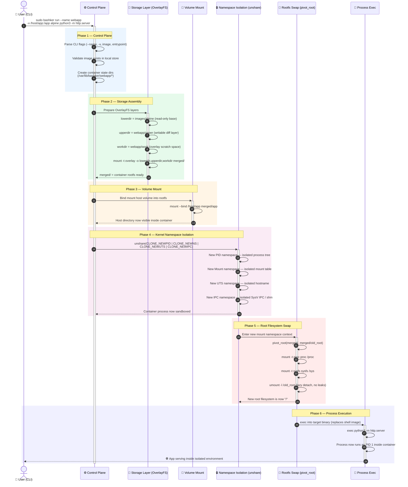

<div align="center">

# 🐚 Bashker

### *A container engine forged in pure Bash — no daemons, no dependencies, just the kernel.*

[](https://www.gnu.org/software/bash/)
[](https://kernel.org)
[](https://docs.kernel.org/filesystems/overlayfs.html)
[](#license)
[](#prerequisites--installation)

</div>

---

## 📋 Executive Summary

**Bashker** is a from-scratch container runtime built entirely in POSIX-adjacent Bash, with zero reliance on `runc`, `containerd`, `libcontainer`, or any Go-based OCI tooling. It exists to answer a question most engineers using Docker every day have never had to answer themselves:

> *What actually happens, at the syscall level, when you run `docker run`?*

Rather than wrapping an existing runtime, Bashker speaks directly to the Linux kernel — invoking `unshare(2)`, assembling `OverlayFS` mounts by hand, and performing `pivot_root(2)` transitions using nothing but shell built-ins and standard `util-linux` tools. The result is a fully functional, isolated container environment (separate PID tree, separate filesystem view, separate hostname, separate IPC namespace) driven entirely by shell script.

**This project exists to demonstrate:**
- Fluency in **Linux kernel isolation primitives** (namespaces, mount propagation, pivot_root) without a runtime abstracting them away.
- The ability to design and implement **systems-level tooling** in a constrained, dependency-free environment.
- A working mental model of **what container engines like Docker and Podman are actually doing under the hood.**

Bashker is not a Docker replacement. It is a transparent, inspectable, hackable reference implementation — the kind of project that turns "I use Docker" into "I understand containers."

---

## 🏗️ Architecture: Container Lifecycle Deep-Dive

The diagram below traces the full execution path of:

```bash
sudo bashker run --name webapp -v /host/app:/app alpine python3 -m http.server
```

From CLI invocation to a fully isolated PID 1 process serving HTTP traffic.



> **Key design note:** namespace isolation (`unshare`) is entered *before* the `pivot_root` call, since `pivot_root` must operate inside the new mount namespace to avoid leaking the host's mount table into the container.

---

## 🔬 Technical Highlights: Mapping Bashker to OCI Concepts

Docker and other OCI-compliant runtimes wrap these same kernel primitives behind layers of Go abstraction (`libcontainer`, `runc`, `containerd-shim`). Bashker strips that abstraction away, calling the primitives directly.

| Concept | Docker / OCI Abstraction | Bashker's Raw Implementation |
|---|---|---|
| **Storage** | Copy-on-Write "image layers" via `overlay2` storage driver | Manual `mount -t overlay` with explicit `lowerdir`, `upperdir`, `workdir` — no storage driver abstraction, the merge logic is visible and editable |
| **Isolation** | `libcontainer` configures namespaces via `clone(2)` flags at process creation | Direct `unshare(2)` syscall wrapper (via `unshare` CLI) combined with `pivot_root(2)`, invoked explicitly rather than hidden inside a runtime binary |
| **Root Transition** | `runc` performs `pivot_root` internally as part of OCI spec execution | Bashker performs `pivot_root` manually, followed by explicit `/proc` and `/sys` remounts and a **lazy unmount** (`umount -l`) of `/old_root` to avoid dangling mount references |
| **Networking** | CNI plugins + virtual bridges (`docker0`) + iptables NAT rules | *(Roadmap)* Manual `veth` pair creation + network namespace (`CLONE_NEWNET`) + bridge attachment |
| **Image Format** | OCI Image Spec (JSON manifests, gzip tar layers, content-addressable blobs) | Flat rootfs tarballs (Alpine minirootfs) extracted directly to a lowerdir — no manifest layer, prioritizing simplicity over spec compliance |
| **Lifecycle Engine** | `containerd` daemon manages state via gRPC + a persistent supervisor | Stateless Bash scripts + flat-file state under `/var/lib/bashker/` — no long-running daemon, every command is a fresh invocation |
| **Process Supervision** | `containerd-shim` reparents to PID 1 of container, handles signal forwarding | Container entrypoint *is* PID 1 directly via `exec` — no shim layer, meaning Bashker must handle **zombie reaping and signal forwarding manually** (see Learnings below) |

<details>
<summary><strong>📦 Why OverlayFS instead of naive directory copying?</strong></summary>

<br>

A naive container implementation might `cp -r` the base image for every container instance. This is slow and disk-heavy. OverlayFS instead uses a **union mount**: the read-only `lowerdir` (base image) is layered underneath a writable `upperdir`, with the kernel presenting a single merged view. Writes are redirected to `upperdir` via copy-up semantics — a file is only copied from `lowerdir` to `upperdir` the moment it's modified. This gives Bashker near-instant container startup and directly mirrors how Docker's `overlay2` storage driver achieves the same effect.

</details>

<details>
<summary><strong>🔒 Why unshare + pivot_root instead of chroot?</strong></summary>

<br>

`chroot(2)` only changes the apparent root directory for filesystem lookups — it does **not** isolate the process tree, hostname, IPC, or mount table, and it is well-documented as escapable by a sufficiently privileged process with the right tricks. `pivot_root(2)`, combined with a dedicated mount namespace via `unshare`, actually swaps the root mount point at the kernel level and allows the old root to be detached entirely (`umount -l /old_root`), leaving no accessible path back to the host filesystem from inside the container.

</details>

---

## ⚙️ Prerequisites & Installation

### System Requirements

| Requirement | Minimum | Why |
|---|---|---|
| **Linux Kernel** | `4.18+` | Required for stable `unshare`, OverlayFS on tmpfs, and unprivileged user namespace features used internally |
| **Privileges** | `root` / `sudo` | Namespace creation, mount operations, and `pivot_root` are privileged syscalls |
| **Shell** | `Bash 4.4+` | Uses associative arrays and `local -n` nameref support |
| **Core Utilities** | `util-linux` (`unshare`, `nsenter`, `mount`), `curl`, `tar`, `rsync` | Kernel primitive invocation, image fetching, and layer management |

### Installation

```bash
# 1. Clone the repository
git clone https://github.com/<your-username>/bashker.git
cd bashker

# 2. Verify kernel compatibility
uname -r   # should report 4.18 or higher

# 3. Make the entrypoint executable
chmod +x bashker

# 4. Install system-wide (optional, recommended)
sudo cp bashker /usr/local/bin/bashker

# 5. Verify installation
bashker --version
```

<details>
<summary><strong>🩺 Environment sanity check</strong></summary>

<br>

Bashker ships with a preflight check to confirm your kernel exposes the required primitives before you run your first container:

```bash
bashker doctor
```

This verifies:
- `unshare` supports `CLONE_NEWPID`, `CLONE_NEWNS`, `CLONE_NEWUTS`, `CLONE_NEWIPC`
- OverlayFS kernel module is loaded (`modprobe overlay`)
- `/proc/sys/kernel/unprivileged_userns_clone` (if applicable to your distro)
- Required binaries (`curl`, `tar`, `rsync`, `mount`, `umount`) are present on `$PATH`

</details>

---

## 🖥️ CLI Reference & Usage

### Pull a base rootfs image

```bash
bashker pull alpine
```
> Downloads and extracts a minimal Alpine root filesystem into the local image store (`/var/lib/bashker/images/alpine`).

### Build a custom image

```bash
bashker build -t my-python-app:latest -f ./Bashkerfile .
```
> Layers custom filesystem changes on top of a base image and commits the result as a new named image, using a `Bashkerfile` (Bashker's Dockerfile-equivalent build spec).

### Run an isolated container

```bash
sudo bashker run --name webapp -v /host/app:/app alpine python3 -m http.server
```

| Flag | Description |
|---|---|
| `--name webapp` | Assigns a human-readable identifier for lifecycle management |
| `-v /host/app:/app` | Bind-mounts host path `/host/app` to `/app` inside the container |
| `alpine` | Base image to construct the container rootfs from |
| `python3 -m http.server` | Entrypoint command, executed as PID 1 via `exec` |

### Manage container state

```bash
# List running and stopped containers
bashker ps -a

# Freeze current container state into a new reusable image
bashker commit webapp webapp-snapshot:v1

# Gracefully stop a running container
bashker stop webapp

# Remove a stopped container and reclaim its overlay layers
bashker rm webapp
```

<details>
<summary><strong>📖 Full command reference</strong></summary>

<br>

```
bashker pull <image>                 Fetch a base rootfs image
bashker build -t <tag> -f <file> .   Build an image from a Bashkerfile
bashker images                       List locally available images
bashker run [flags] <image> <cmd>    Create and start a new container
bashker ps [-a]                      List containers (running, or all)
bashker exec <name> <cmd>            Run a command inside a running container
bashker stop <name>                  Send SIGTERM and tear down namespaces
bashker rm <name>                    Remove container state and overlay dirs
bashker commit <name> <new-tag>      Snapshot container upperdir into an image
bashker logs <name>                  Stream stdout/stderr from the container
bashker doctor                       Run environment/kernel compatibility checks
```

</details>

---

## 🧠 Technical Learnings & Engineering Takeaways

Building a container runtime from raw kernel primitives — rather than consuming one — surfaces failure modes and design constraints that are otherwise invisible behind Docker's abstractions.

- **PID 1 is a special contract, not just a number.** Once `exec` replaces the shell with the container's entrypoint, that process becomes PID 1 *inside its namespace* and inherits full responsibility for reaping zombie children — a job normally handled invisibly by `init` or a container shim (`containerd-shim`, `tini`). Skipping this leads to defunct zombie processes accumulating silently inside long-running containers.

- **Mount propagation determines whether isolation actually holds.** A mount namespace created without setting mount propagation to `private` (`mount --make-rprivate /`) can leak mount/unmount events bidirectionally with the host, silently defeating the isolation the namespace was meant to provide. Getting this ordering wrong is one of the easiest ways to build a container that *looks* isolated but isn't.

- **Copy-on-Write isn't just a performance trick — it's what makes containers cheap.** Because OverlayFS defers copying a file from `lowerdir` to `upperdir` until the first write, dozens of containers can share a single immutable base image on disk and in the page cache, with per-container storage cost limited to the delta they actually create.

- **Lazy unmounts exist because "clean" unmounts often aren't possible.** Detaching `/old_root` after `pivot_root` with a standard `umount` frequently fails with `EBUSY` because a reference to the old root may still be technically open somewhere in the mount tree. `umount -l` detaches the mount point from the namespace immediately while deferring actual cleanup until the last reference drops — a distinction that matters when building anything expected to reliably clean up after itself at scale.

---

## 🗺️ Roadmap

- [ ] Network namespace isolation (`CLONE_NEWNET`) with `veth` pair + bridge networking
- [ ] cgroups v2 integration for CPU/memory resource limits
- [ ] Rootless mode via user namespaces (`CLONE_NEWUSER`)
- [ ] OCI Image Spec compatibility for pulling from standard registries

---

## 📄 License

Distributed under the MIT License. See `LICENSE` for details.

---

<div align="center">

*Built to understand containers from the syscall up — not to replace Docker, but to demystify it.*

</div>
